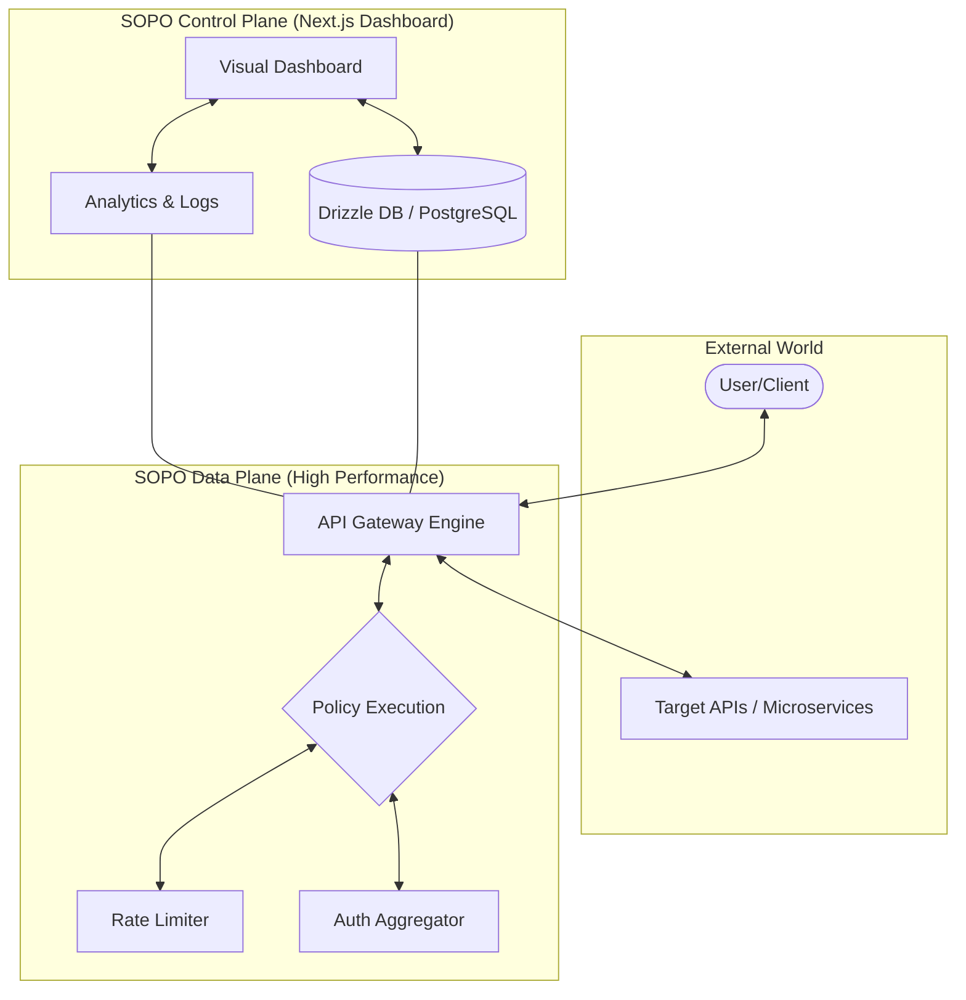
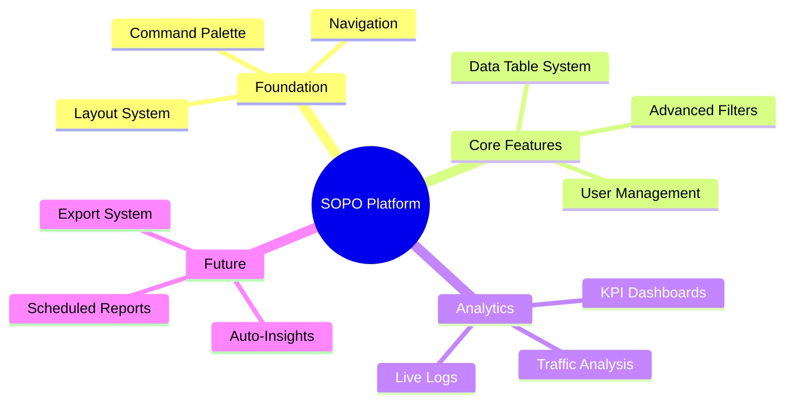

#  SOPO Gateway - Next-Gen API Lifecycle Platform

[](https://nextjs.org/)
[](https://tailwindcss.com/)
[](https://www.typescriptlang.org/)
[](https://opensource.org/licenses/MIT)

**Sopo** is a modern, high-performance API lifecycle automation platform. It transforms complex policy configurations into a clear, unified visual pipeline, enabling developers to manage APIs with speed, security, and simplicity.

---

## 📊 Project Overview (نظرة عامة)

| Feature | Description | Status |
| :--- | :--- | :--- |
| **Layout System** | Foundation with Sidebar, Topbar, and Mobile support | ✅ Completed |
| **Analytics** | KPI Cards, Traffic Charts, and Live Logs | ✅ Completed |
| **Data Tables** | Generic, sortable, and paginated table system | ✅ Completed |
| **User Mgmt** | Full CRUD, Roles, and Permissions Matrix | ✅ Completed |
| **Reports** | Automated insights and export system | 🏗️ In Progress |

---

## 🏗️ Architecture (الهيكل الهندسي)

The platform is split into a **Data Plane** for high-speed request processing and a **Control Plane** for visual management.



---

## 🚀 Key Features

-   **⚡ Ultra-Low Latency:** Optimized request routing with minimal overhead.
-   **🛡️ Advanced Security:** Built-in rate limiting, IP whitelisting, and DDoS protection.
-   **📈 Real-time Analytics:** Monitor traffic, latency, and error rates via interactive Recharts dashboards.
-   **👥 User Management:** Granular RBAC (Role-Based Access Control) with a visual permissions matrix.
-   **🔍 Filter System:** Advanced data filtering with persistence and date-range selection.
-   **📋 Spec-Driven Development:** Entirely documented via a comprehensive `Spec-Kit`.

---

## 🛠️ Tech Stack

-   **Framework:** [Next.js 16](https://nextjs.org/) (App Router, Turbopack)
-   **Styling:** [Tailwind CSS 4](https://tailwindcss.com/) + [Shadcn UI](https://ui.shadcn.com/)
-   **Visuals:** [Recharts](https://recharts.org/) (Analytics) + [Mermaid](https://mermaid.js.org/) (Documentation)
-   **Database:** [PostgreSQL](https://www.postgresql.org/) with [Drizzle ORM](https://orm.drizzle.team/)
-   **State Management:** [TanStack Query v5](https://tanstack.com/query)
-   **Animations:** [Framer Motion](https://www.framer.com/motion/) + [Magic UI](https://magicui.design/)

---

## 🗺️ Feature Roadmap



---

## 🏁 Getting Started

### Prerequisites
- Node.js (v20+)
- PostgreSQL

### Installation
1.  **Clone the repository:**
    ```bash
    git clone https://github.com/Bushetaa/SopoWeb.git
    cd SOPO
    ```
2.  **Install dependencies:**
    ```bash
    npm install
    ```
3.  **Run development server:**
    ```bash
    npm run dev
    ```

---

## 📚 Documentation (Spec-Kit)

The project follows a strict specification-driven development process. You can find all specifications in the [specs/](file:///e:/workWeb/SOPO/specs) directory:
- [00-INDEX.md](file:///e:/workWeb/SOPO/specs/00-INDEX.md) - Full project index and status.
- [02-ANALYTICS.md](file:///e:/workWeb/SOPO/specs/02-ANALYTICS.md) - Detailed analytics requirements.
- [05-USERS-MANAGEMENT.md](file:///e:/workWeb/SOPO/specs/05-USERS-MANAGEMENT.md) - User management logic.

---

## 📄 License
MIT
