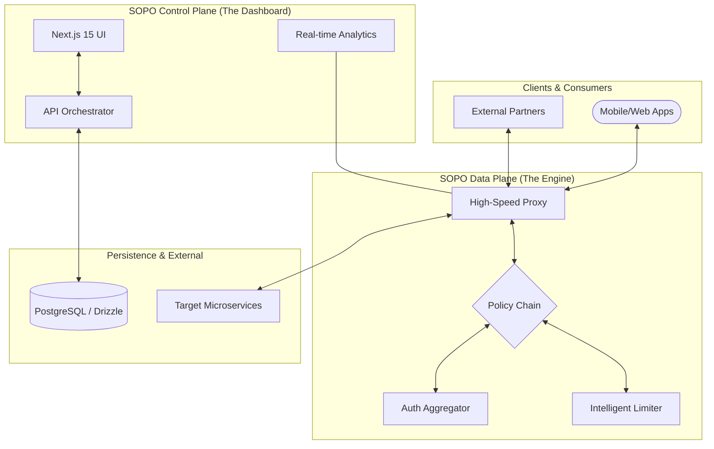

#  SOPO — Enterprise API Lifecycle Automation Platform

[](https://nextjs.org/)
[](https://tailwindcss.com/)
[](https://www.typescriptlang.org/)
[](https://opensource.org/licenses/MIT)
[](https://github.com/Bushetaa/SopoWeb)

**Sopo** is an advanced, high-performance API lifecycle automation platform designed for modern engineering teams. It transforms complex network policies and API orchestration into a unified, high-fidelity visual experience, allowing teams to manage microservices at scale with unprecedented speed and precision.

---

## 🌟 Vision & Purpose

In the era of microservices, managing the connectivity between hundreds of services becomes a bottleneck. **Sopo** bridges the gap between infrastructure complexity and developer productivity. By providing a **Control Plane** that is both powerful and intuitive, Sopo enables:

- **Rapid Deployment:** Go from service definition to live traffic routing in minutes.
- **Visual Intelligence:** Gain deep insights into traffic patterns, health metrics, and performance bottlenecks.
- **Enterprise-Grade Security:** Centralize authentication, rate-limiting, and security policies without touching backend code.

---

## 🏗️ System Architecture

Sopo is architected for extreme scalability, decoupling the management interface from the high-speed data processing engine.



---

## 🚀 Key Modules & Capabilities

### 🌐 Gateway Management
- **Infrastructure Orchestration:** Deploy and manage global API Gateways with multi-region support.
- **Execution Modes:** Choose between `Single Node` for development and `Pro Cluster` for high-availability production environments.
- **Health Monitoring:** Real-time "Live/Dormant" status tracking with automated pulse checks.

### 🛠️ Service & Target Mesh
- **Upstream Abstraction:** Decouple public routes from internal backend endpoints.
- **Traffic Weighting:** Sophisticated load balancing with visual weight distribution bars.
- **Protocol Versatility:** Support for HTTP, gRPC, and specialized enterprise protocols.

### 🛣️ Advanced Routing
- **Path-Based Discovery:** Define complex routing rules based on URL patterns, methods, and headers.
- **Aggregate Requests:** Orchestrate multiple sub-requests into a single client-facing endpoint.
- **Zero-Drip Configuration:** Hot-reload routes without dropping a single active connection.

### 📊 Intelligence & Analytics
- **KPI Dashboards:** Monitor Total Requests, Latency, Error Rates, and Throughput.
- **Live Logs:** Real-time log streaming for rapid debugging and security auditing.
- **Historical Analysis:** Deep-dive into traffic trends using interactive, time-filtered charts.

---

## 🛠️ Tech Stack & Tooling

| Layer | Technology |
| :--- | :--- |
| **Framework** | [Next.js 15](https://nextjs.org/) (App Router, Turbopack) |
| **Language** | [TypeScript](https://www.typescriptlang.org/) (Strict Mode) |
| **Styling** | [Tailwind CSS 4.0](https://tailwindcss.com/) + [Shadcn UI](https://ui.shadcn.com/) |
| **State** | [TanStack Query v5](https://tanstack.com/query) + React Context |
| **Charts** | [Recharts](https://recharts.org/) (High Fidelity Visuals) |
| **Database** | [PostgreSQL](https://www.postgresql.org/) with [Drizzle ORM](https://orm.drizzle.team/) |
| **Icons** | [Lucide React](https://lucide.dev/) |

---

## 📁 Project Structure

```bash
sopo-frontend/
├── app/                  # Next.js 15 App Router (Dashboard & Landing)
│   ├── (dashboard)/      # Protected management interface
│   ├── api-gateway/      # Gateway-specific orchestration
│   └── globals.css       # Tailwind 4 configuration
├── components/           # Atomic UI & Specialized Dashboard Components
│   ├── ui/               # Base Shadcn/Radix components
│   ├── analytics/        # High-fidelity chart implementations
│   └── api-gateway/      # Infrastructure management forms
├── hooks/                # Custom business logic & data fetching (React Query)
├── lib/                  # Shared utilities, API client, and constants
├── specs/                # Comprehensive technical specifications (Spec-Kit)
└── shared/               # Shared TypeScript schemas and validation logic
```

---

## 🏁 Getting Started

### Prerequisites
- **Node.js:** v20.0.0 or higher
- **Package Manager:** npm (v10+)
- **Database:** PostgreSQL instance (local or hosted)

### Installation & Setup

1. **Clone & Enter:**
   ```bash
   git clone https://github.com/Bushetaa/SopoWeb.git
   cd sopo-frontend
   ```

2. **Dependency Resolution:**
   ```bash
   npm install
   ```

3. **Environment Configuration:**
   Create a `.env.local` file and provide your API endpoints and database credentials.

4. **Launch Development:**
   ```bash
   npm run dev
   ```
   *Access the platform at `http://localhost:3000`*

---

## 📚 Documentation (Spec-Kit)

Sopo is built on a "Spec-First" philosophy. Our internal documentation is exhaustive:
- [00-INDEX.md](file:///specs/00-INDEX.md) - Project status and technical roadmap.
- [01-LAYOUT-SYSTEM.md](file:///specs/01-LAYOUT-SYSTEM.md) - UI/UX principles and responsive system.
- [02-ANALYTICS.md](file:///specs/02-ANALYTICS.md) - Data processing and visualization logic.

---

## 📄 License
Released under the [MIT License](https://opensource.org/licenses/MIT). Built with ❤️ by the Sopo Engineering Team.
